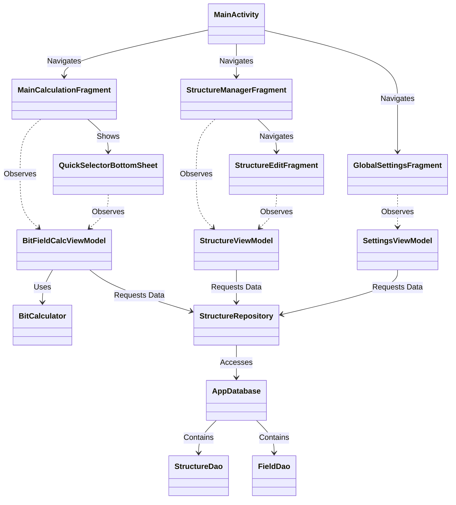

# 基本設計書：ビットフィールド電卓アプリ (BitField Calc)

## 1. クラス関係図・アーキテクチャ設計

本アプリケーションは、Android推奨の**MVVM（Model-View-ViewModel）アーキテクチャ**を採用し、単一のアクティビティ構造（Single Activity / Multiple Fragments & Compose UI）で構築します。

### 1.1 クラス名と日本語名（責責）の対応表

| クラス名 | 日本語名（役割・責務） | 概要 |
| :--- | :--- | :--- |
| `MainActivity` | メインアクティビティ | アプリ唯一の基盤Activity。全画面のコンテナおよびEdge-to-Edgeの管理。 |
| `MainCalculationFragment` | メイン計算画面（SCR-001） | ビットグリッドや各基数入力、デコード結果を表示・操作する主画面。 |
| `QuickSelectorBottomSheet` | クイックセレクター（SCR-002）| 構造体を瞬時に検索・切り替えるためのボトムシートUI。 |
| `StructureManagerFragment` | 構造体マネージャー（SCR-003）| 構造体の一覧表示、並び替え、スワイプ削除を行う管理画面。 |
| `StructureEditFragment` | 構造体編集・作成画面（SCR-004）| 構造体名、タグ、フィールド定義（ビット範囲など）の編集・作成画面。 |
| `GlobalSettingsFragment` | グローバル設定画面（SCR-005）| エンディアンやビットオーダーの設定、JSON入出力を行う画面。 |
| `BitFieldCalcViewModel` | 共通計算・状態管理ViewModel | 共有データ（現在の生データ、選択中の構造体など）の保持とリアルタイム相互変換・デコード演算。 |
| `StructureViewModel` | 構造体管理ViewModel | 構造体の追加・編集・削除、バリデーション、およびUndo処理のライフサイクル管理。 |
| `SettingsViewModel` | 設定ViewModel | アプリ環境設定（エンディアン等）の永続化トリガー、JSONパース・ファイルI/O制御。 |
| `BitCalculator` | ビット演算ロジック（ドメイン） | 64bit内部数値表現のパース、相互基数変換、ビットシフト・マスク処理の純粋ロジック。 |
| `StructureRepository` | 構造体データリポジトリ | データベース（Room）およびデータエクスポート（JSON）のデータアクセス抽象化。 |
| `AppDatabase` | ルームデータベース | Room永続化ライブラリのデータベースインスタンス。 |
| `StructureDao` | 構造体データアクセスオブジェクト | `structures` テーブルへのCRUD操作、インクリメンタル検索クエリの定義。 |
| `FieldDao` | フィールドデータアクセスオブジェクト | `fields` テーブルへのCRUD操作、構造体IDに紐づく一括削除などの定義。 |

### 1.2 クラス関係図（Mermaid）



## 1.3 ディレクトリ構成（パッケージ構造）

本アプリのソースコードは、機能ごとのカプセル化とMVVMの責務分離を両立するため、以下のパッケージ構造で配置します。Android 15のEdge-to-Edge対応やJetpack ComposeによるUIコンポーネントも、この構造に従って適切に配置します。


```

app/
├── src/
│   ├── main/
│   │   ├── java/com/kouichi/highcom/bitfieldcalc/
│   │   │   ├── data/                         # データレイヤー（永続化・外部データI/O）
│   │   │   │   ├── db/
│   │   │   │   │   ├── AppDatabase.kt        # Roomデータベース定義
│   │   │   │   │   ├── dao/
│   │   │   │   │   │   ├── StructureDao.kt   # structuresテーブル用DAO
│   │   │   │   │   │   └── FieldDao.kt       # fieldsテーブル用DAO
│   │   │   │   │   └── entity/
│   │   │   │   │       ├── StructureEntity.kt
│   │   │   │   │       └── FieldEntity.kt
│   │   │   │   └── repository/
│   │   │   │       └── StructureRepository.kt # データアクセスの抽象化・一元管理
│   │   │   │
│   │   │   ├── domain/                       # ドメインレイヤー（純粋なビジネスロジック）
│   │   │   │   └── model/
│   │   │   │       └── BitCalculator.kt      # 64bit基数変換・マスク・シフト演算ロジック
│   │   │   │
│   │   │   └── ui/                           # UIレイヤー（画面表示・状態管理）
│   │   │       ├── MainActivity.kt           # 基盤Activity（Edge-to-Edge/Navigation管理）
│   │   │       │
│   │   │       ├── calculation/              # メイン計算画面（SCR-001）
│   │   │       │   ├── MainCalculationFragment.kt
│   │   │       │   ├── BitFieldCalcViewModel.kt
│   │   │       │   └── components/           # Compose用カスタムUI（ビットグリッド等）
│   │   │       │       ├── BitGrid.kt
│   │   │       │       └── NumberInputFields.kt
│   │   │       │
│   │   │       ├── selector/                 # クイックセレクター（SCR-002）
│   │   │       │   └── QuickSelectorBottomSheet.kt
│   │   │       │
│   │   │       ├── manager/                  # 構造体マネージャー（SCR-003）
│   │   │       │   ├── StructureManagerFragment.kt
│   │   │       │   └── StructureViewModel.kt # マネージャー・編集共通のViewModel
│   │   │       │
│   │   │       ├── edit/                     # 構造体編集・作成画面（SCR-004）
│   │   │       │   └── StructureEditFragment.kt
│   │   │       │
│   │   │       ├── settings/                 # グローバル設定画面（SCR-005）
│   │   │       │   ├── GlobalSettingsFragment.kt
│   │   │       │   └── SettingsViewModel.kt
│   │   │       │
│   │   │       └── theme/                    # アプリ共通のデザインシステム（Compose用）
│   │   │           ├── Color.kt              # フラットデザイン/Material Designカラー定義
│   │   │           ├── Theme.kt
│   │   │           └── Type.kt
│   │   │
│   │   └── res/                              # 各種リソースファイル
│   │       ├── layout/                       # 各FragmentのベースとなるXMLレイアウト
│   │       ├── navigation/
│   │       │   └── nav_graph.xml             # Single Activityの画面遷移定義（Navigation）
│   │       └── values/
│   │           └── strings.xml               # 文字列リソース（エラーメッセージ含む）

```

### ディレクトリ構成における設計方針

1. **`data/` パッケージの隔離:**
   * データベースのエンティティやDAO、外部JSONファイルとのやり取りを完全に閉じ込め、UI層が直接SQLiteクエリに依存しないようにしています。
2. **`domain/` パッケージの独立:**
   * `BitCalculator.kt` などのビット演算コアロジックを、Androidのフレームワーク（ContextやUIライフサイクル）から完全に独立させ、Pure Kotlinで記述できるようにしています。これにより、単体テスト（Unit Test）が容易になります。
3. **`ui/` パッケージ内の機能別分割:**
   * メイン画面、マネージャー画面、設定画面などの各機能をパッケージ単位で分割しています。これにより、関連するFragment、ViewModel、および画面固有のComposeコンポーネント（`components/`）が同じディレクトリ内にまとまり、ソースコードの視認性と保守性が高まります。
4. **`theme/` パッケージの配置:**
   * ご提示いただいた方向性（フラットデザイン、Material Design、グラデーションの排除、警告時の薄赤インライン警告など）を統一的に表現するため、Composeのカラー・テーマ定義を一元管理するパッケージを配置しています。


---

## 2. 各クラス仕様書

### 2.1 画面・ビューコンポーネント（View Layer）

#### MainActivity

* **責務と概要:** アプリケーションの単一エントリポイントとなるActivity。Navigation Componentのコンテナとして機能し、Android 15のEdge-to-Edge（全画面）表示のシステムインセット配置を一元管理します。
* **メソッド一覧:**
* `onCreate(savedInstanceState: Bundle?)`: 画面の初期化、Edge-to-Edgeの設定（`enableEdgeToEdge()`）、およびナビゲーションホストのセットアップを行います。


#### MainCalculationFragment

* **責務と概要:** SCR-001（メイン計算画面）のUI制御。ビットグリッド（Jetpack Composeで実装）やテキスト入力フィールド、デコード結果のRecyclerView/LazyColumnを制御し、ユーザーのアクションを `BitFieldCalcViewModel` へ伝達します。
* **メソッド一覧:**
* `onCreateView(...)`: Composeビュー、またはXMLレイアウトをインフレートし初期化します。
* `onViewCreated(...)`: ViewModelのState（生データ、基数文字列、デコードリスト）を検索・購読（Observe）し、UIにリアルタイム反映します。
* `showQuickSelector()`: 構造体名タップ時に `QuickSelectorBottomSheet` を呼び出します。


#### QuickSelectorBottomSheet

* **責務と概要:** SCR-002（クイックセレクター）の実装。ボトムシート形式で構造体一覧を格納。インクリメンタル検索窓を提供し、タップされた構造体を即座にメイン画面へ適用します。
* **メソッド一覧:**
* `onSearchQueryChanged(query: String)`: 検索窓の入力内容をViewModelに伝え、リストをリアルタイム絞り込みます。
* `onStructureSelected(structureId: Long)`: 選択された構造体IDを共有ViewModelにセットし、ボトムシートを閉じます。


#### StructureManagerFragment

* **責務と概要:** SCR-003（構造体マネージャー）のUI制御。登録されている構造体を一覧表示し、ドラッグ＆ドロップによる並び替え、および左スワイプによる削除（Undo付き）を処理します。
* **メソッド一覧:**
* `onItemSwiped(position: Int)`: リスト項目がスワイプされた際、ViewModelに削除一時待機（非表示化）を要求し、画面下部にUndo用スナックバーを表示します。
* `showUndoSnackbar()`: Undoボタン付きのスナックバーを3秒間表示し、タップされればリポジトリの削除をキャンセル、タイムアウトすれば物理削除を確定します。
* `onItemMoved(fromPosition: Int, toPosition: Int)`: ドラッグハンドルによる並び替え順序の変更をViewModelに通知します。


#### StructureEditFragment

* **責務と概要:** SCR-004（構造体編集・作成画面）のUI制御。新規作成または既存の構造体/フィールドの定義・編集を行います。バリデーションエラー時にはエラーをインライン表示します。
* **メソッド一覧:**
* `onSaveClicked()`: 保存ボタン押下時。入力データを収集し、ViewModelのバリデーションを呼び出した上で保存処理を実行します。
* `onAddFieldClicked()`: フィールド定義行を動的に1行追加します。
* `showValidationError(message: String)`: ビット範囲重複などのエラーメッセージを画面上にダイアログまたはテキストで明示します。


#### GlobalSettingsFragment

* **責務と概要:** SCR-005（グローバル設定画面）のUI制御。エンディアン、ビットオーダーの設定変更スイッチの提供、およびJSONファイルのインポート/エクスポート用ファイル選択インテント（SAF: Storage Access Framework）のトリガー。
* **メソッド一覧:**
* `onEndianChanged(isBigEndian: Boolean)`: エンディアン設定切り替えをViewModelに通知します。
* `onBitOrderChanged(isMsbFirst: Boolean)`: ビットオーダー設定切り替えをViewModelに通知します。
* `triggerExportFile()`: 端末内ローカルへのJSONファイル書き出しインテントを起動します。
* `triggerImportFile()`: JSONファイル選択画面を起動します。


---

### 2.2 状態管理・ビジネスロジック（ViewModel & Domain Layer）

#### BitFieldCalcViewModel

* **責務と概要:** メイン計算画面（SCR-001）とクイックセレクター（SCR-002）の状態（State）を管理・共有するViewModel。数値が入力されるたびに `BitCalculator` を用いて、各基数の同期文字列およびフィールドデコード結果をリアクティブ（StateFlow）に更新します。
* **メソッド一覧:**
* `updateRawValueFromHex(hexStr: String)`: HEX入力欄からの変更を受け取り、内部数値を更新。他基数およびデコード結果を再計算させます。
* `updateRawValueFromDec(decStr: String)`: DEC入力欄からの変更（オーバーフロー時はバリデーションエラーをUIへ通知）。
* `updateRawValueFromBin(binStr: String)`: BIN入力欄からの変更。
* `toggleBit(bitIndex: Int)`: 指定されたビット位置を反転（0⇔1）させます。
* `loadSelectedStructure(structureId: Long)`: デコード対象の構造体を切り替えます。
* `searchStructures(query: String)`: クイックセレクター用の部分一致絞り込み状態を更新します。


#### StructureViewModel

* **責務と概要:** 構造体のCRUD操作および編集画面の入力バリデーションを制御するViewModel。削除の一時保留（Undoタイマー）のライフサイクルも管理します。
* **メソッド一覧:**
* `validateAndSaveStructure(structureName: String, tag: String?, fields: List<FieldEntity>): Boolean`: フィールドのビット重複（例: [15:8]と[10:4]）や32/64bit制限チェックを実行。正常ならリポジトリ経由で保存し `true`、異常なら `false` を返します。
* `pendingDeleteStructure(structureId: Long)`: 対象の構造体をUIから一時削除し、物理削除用タイマー（3秒）を起動します。
* `cancelDeleteStructure()`: タイマーを破棄し、UIリストの非表示状態を復元します。
* `commitDeleteStructure(structureId: Long)`: 3秒経過後に呼び出され、物理削除をリポジトリへ要求します。
* `updateSortOrder(structures: List<StructureEntity>)`: 並び替え後の順序（`sort_order`）をDBへ保存します。


#### SettingsViewModel

* **責務と概要:** アプリの動作環境（エンディアン等）の永続化、および外部JSONファイルのパース・I/Oを制御するViewModel。
* **メソッド一覧:**
* `saveEnvironmentSettings(isBigEndian: Boolean, isMsbFirst: Boolean)`: SharedPreferencesまたはDataStoreへ設定を即時保存し、アプリ全体へ通知します。
* `exportStructuresToJson(uri: Uri)`: リポジトリから全構造体データを取得し、スキーマに準拠したJSONとして指定URIへ書き込みます。
* `importStructuresFromJson(uri: Uri): Result<Unit>`: 指定URIのJSONをパース。`JsonSyntaxException` 等をキャッチした場合はエラー（Result.failure）を返し、既存DBデータを維持します。


#### BitCalculator

* **責務と概要:** 純粋な数学的・論理的ビット演算を行うドメインロジッククラス（Androidフレームワーク非依存）。
* **メソッド一覧:**
* `parseStringToLong(value: String, radix: Int): Long`: 各基数文字列を64bit内部表現（Long/BigInteger）へ一元変換します。
* `toRadixString(rawValue: Long, radix: Int): String`: 内部数値を指定された基数（HEX/DEC/BIN）の文字列へ整形します。
* `extractFieldValue(rawValue: Long, msb: Int, lsb: Int, isSigned: Boolean): Long`: 指定されたビット範囲 [msb:lsb] をマスク・シフト演算で切り出し、符号設定（Signed/Unsigned）に応じて2の補数展開等を行い、最終数値を算出します。


---

### 2.3 データアクセス層（Data Layer）

#### StructureRepository

* **責務と概要:** UI/ViewModel層に対して単一のデータアクセス窓口を提供するリポジトリ。Room DB（`StructureDao`, `FieldDao`）の呼び出しを抽象化し、非同期（Coroutines/Flow）でデータを配信します。
* **メソッド一覧:**
* `getAllStructuresWithFields(): Flow<List<StructureWithFields>>`: 全構造体とそれに紐づくフィールドリストをリアルタイムにストリーム配信します。
* `searchStructures(query: String): Flow<List<StructureWithFields>>`: 名前またはタグで絞り込んだ構造体リストを配信します。
* `insertStructureWithFields(structure: StructureEntity, fields: List<FieldEntity>)`: 構造体親レコードとフィールド子レコードを同一トランザクションで保存します。
* `deleteStructure(structureId: Long)`: 構造体を物理削除（外部キーにより子レコードもカスケード削除）します。


#### AppDatabase

* **責務と概要:** Roomデータベースの抽象ベースクラス。SQLiteデータベースのインスタンスを保持・提供します。
* **メソッド一覧:**
* `structureDao()`: `StructureDao` インスタンスを取得します。
* `fieldDao()`: `FieldDao` インスタンスを取得します。


#### StructureDao

* **責務と概要:** `structures` テーブルに対するSQLiteクエリの実行。
* **メソッド一覧:**
* `insert(structure: StructureEntity): Long`
* `update(structure: StructureEntity)`
* `deleteById(id: Long)`
* `getAllLive(): Flow<List<StructureEntity>>`
* `searchLive(query: String): Flow<List<StructureEntity>>`


#### FieldDao

* **責務と概要:** `fields` テーブルに対するSQLiteクエリの実行。
* **メソッド一覧:**
* `insertAll(fields: List<FieldEntity>)`
* `deleteByStructureId(structureId: Long)`
* `getFieldsByStructureId(structureId: Long): List<FieldEntity>`

---

### 基本設計における補足事項
1. **データ連携（Single Activityの強み）:** `BitFieldCalcViewModel` を `ActivityViewModel`（またはHilt等のDIによるコンポーネントスコープ）として宣言することで、メイン画面（SCR-001）とクイックセレクターボトムシート（SCR-002）の間で、現在入力中の「生データ（RawValue）」や「適用中の構造体」の状態を破棄することなく、安全にリアルタイム同期・相互変換を行える設計にしています。
2. **Android 15 Edge-to-Edge対応:** `MainActivity` 内の `onCreate` で一括してインセット（ステータスバー・ナビゲーションバーの高さ等）のバインド処理を行うため、各Fragment側のCompose/レイアウトが崩れないよう下層コンテナとしての責務を集中させています。
3. **データ安全性:** `StructureViewModel` の削除フローにおいて、3秒間のディレイ（コルーチンの `delay(3000)` など）をViewModel側でコントロールし、キャンセルフロー（Undo）が入った場合はジョブをキャンセルするだけでDBに負荷をかけずにUIを差し戻す仕様にしています。
